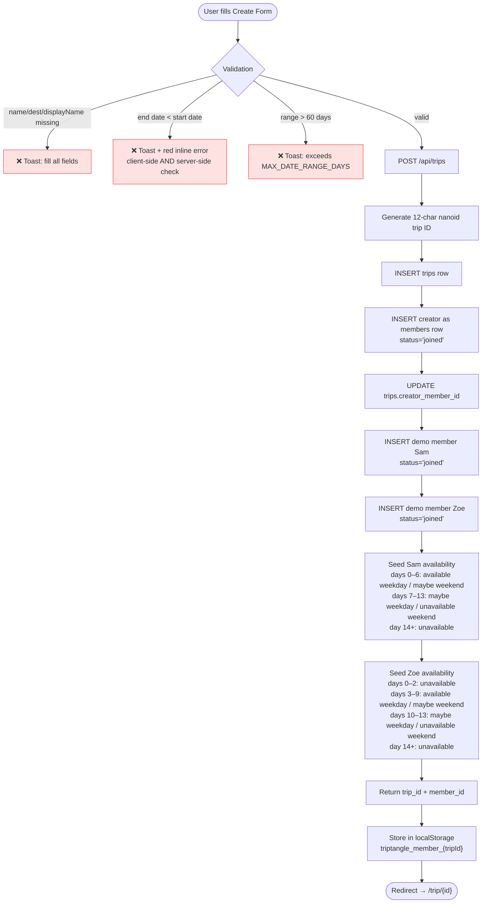
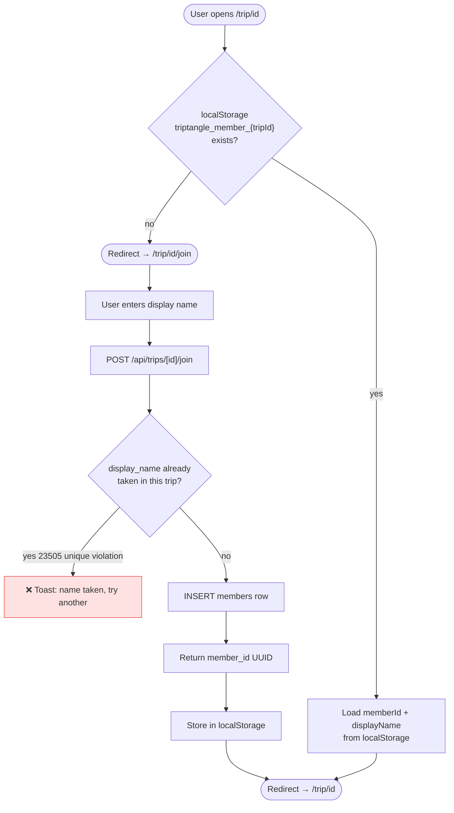
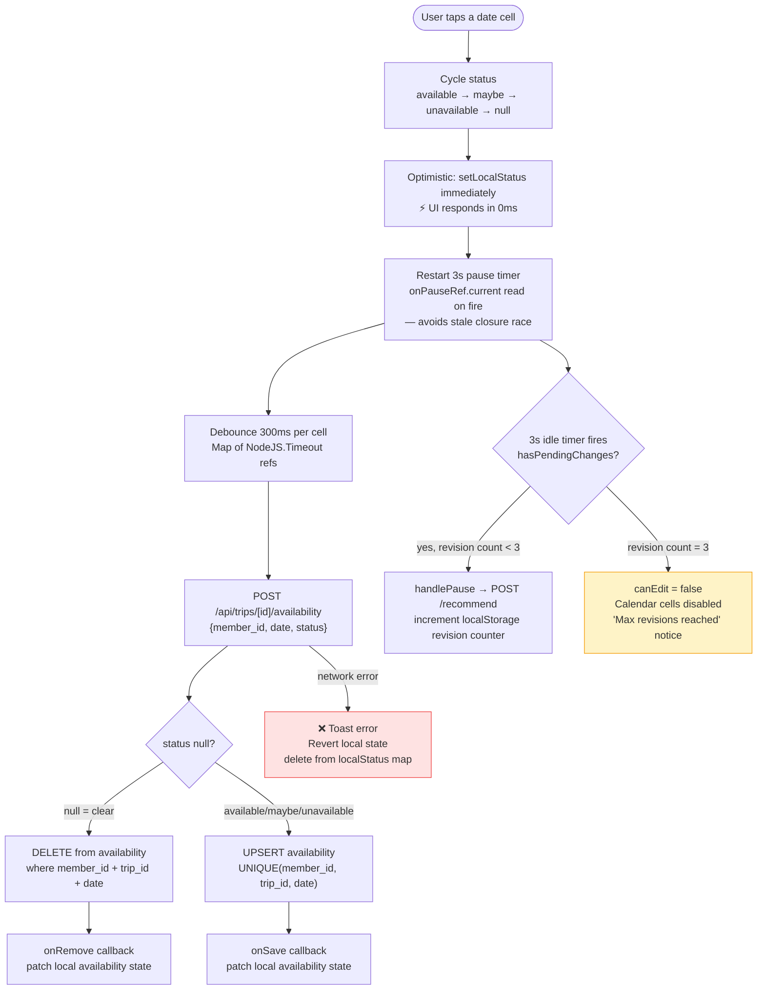
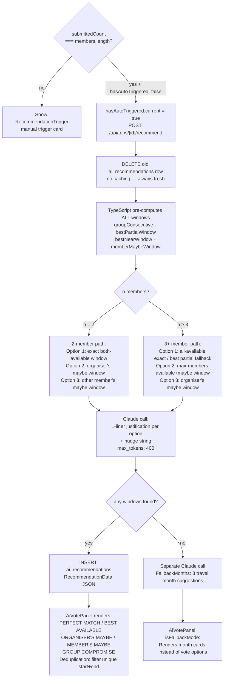
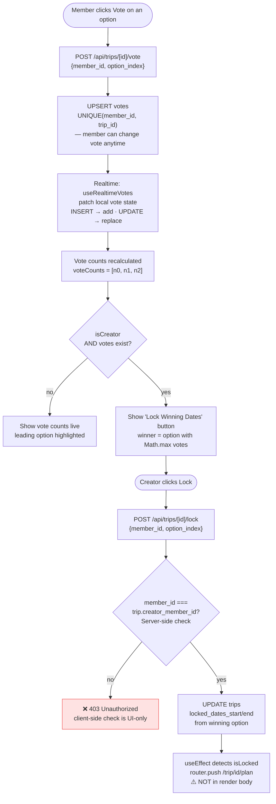
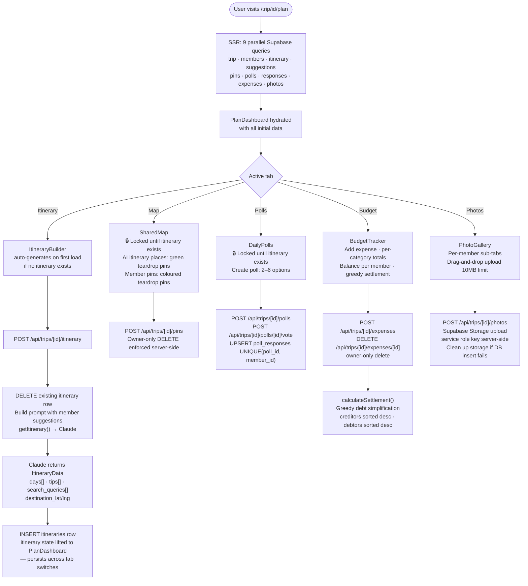
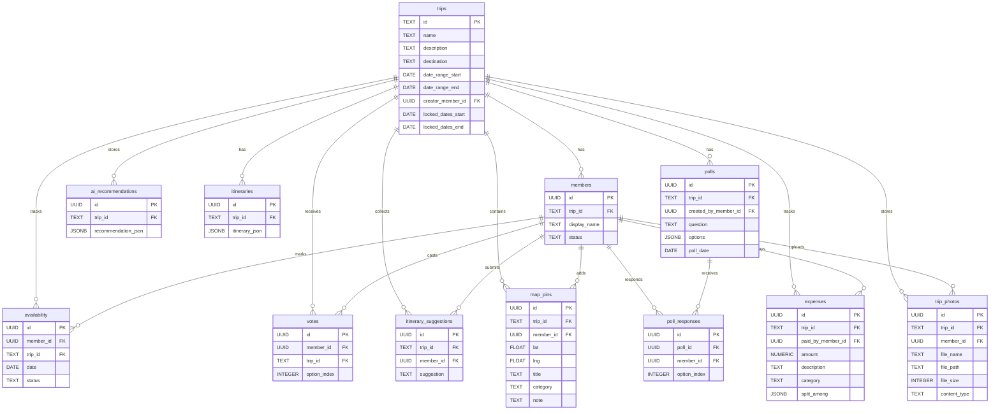

# TripTangle — Data Flow Diagram

> Full system: UI → API → Database → AI, with edge cases annotated inline.

---

## 1. System Architecture Overview

```mermaid
graph TD
  subgraph Browser["🖥️ Client — Browser"]
    UI_CREATE["Create Trip\n/create"]
    UI_DASH["Trip Dashboard\n/trip/[id]"]
    UI_JOIN["Join Page\n/trip/[id]/join"]
    UI_PLAN["Plan Phase\n/trip/[id]/plan"]
    LS["localStorage\ntriptangle_member_{tripId}"]
    RT_HOOKS["Realtime Hooks\nuseMemberIdentity\nuseRealtimeMembers\nuseRealtimeAvailability\nuseRealtimeVotes\nuseRealtimePins\nuseRealtimePolls\nuseRealtimeExpenses\nuseRealtimePhotos"]
  end

  subgraph Vercel["⚡ Next.js Server — Vercel"]
    SSR["Server Components\nParallel Promise.all fetch\n9 queries on plan page"]
    API["Route Handlers\n/api/trips/*\n20+ endpoints"]
    CLAUDE_LIB["claude.ts\nDate pre-computation\nTypeScript owns all logic"]
  end

  subgraph Anthropic["🤖 Anthropic"]
    HAIKU["claude-haiku-4-5-20251001\nJustifications · Nudge\nItinerary · Fallback months"]
  end

  subgraph Supabase["🗄️ Supabase"]
    PG[("PostgreSQL\n12 tables")]
    REALTIME["Realtime\npostgres_changes\n8 subscribed tables"]
    STORAGE["Storage\ntrip-photos bucket\npublic · service role upload"]
  end

  subgraph Google["🗺️ Google"]
    MAPS["Maps JS API\nPlaces API\nGeocoding API"]
  end

  UI_CREATE -->|POST /api/trips| API
  UI_DASH -->|SSR fetch| SSR
  UI_JOIN -->|POST /api/trips/[id]/join| API
  UI_PLAN -->|SSR fetch 9 queries| SSR
  SSR -->|supabase server client| PG
  API -->|supabase server client| PG
  API -->|ANTHROPIC_API_KEY server-only| CLAUDE_LIB
  CLAUDE_LIB -->|messages.create| HAIKU
  RT_HOOKS -->|supabase browser client| REALTIME
  REALTIME -->|postgres_changes INSERT/UPDATE/DELETE| RT_HOOKS
  API -->|service role key| STORAGE
  UI_PLAN -->|NEXT_PUBLIC_GOOGLE_MAPS_API_KEY| MAPS
  UI_CREATE -->|Places autocomplete| MAPS
  UI_DASH -->|read/write| LS
```

---

## 2. Trip Creation Flow



---

## 3. Member Identity & Join Flow



---

## 4. Availability Marking Flow



---

## 5. AI Recommendation Flow



---

## 6. Vote-to-Lock Flow



---

## 7. Plan Phase Flow



---

## 8. Realtime Data Sync

```mermaid
flowchart LR
  subgraph Tables["Supabase Realtime — Subscribed Tables"]
    T1[members]
    T2[availability]
    T3[votes]
    T4[map_pins]
    T5[polls]
    T6[poll_responses]
    T7[expenses]
    T8[trip_photos]
  end

  subgraph Hooks["Client Realtime Hooks — Seed + Patch Pattern"]
    H1["useRealtimeMembers\ninitialMembers prop"]
    H2["useRealtimeAvailability\ninitialAvailability prop"]
    H3["useRealtimeVotes\ninitialVotes prop"]
    H4["useRealtimePins\ninitialPins prop"]
    H5["useRealtimePolls\ninitialPolls prop"]
    H6["useRealtimeExpenses\ninitialExpenses prop"]
    H7["useRealtimePhotos\ninitialPhotos prop"]
  end

  T1 -->|postgres_changes\nfilter: trip_id=eq.{id}| H1
  T2 -->|INSERT/UPDATE/DELETE| H2
  T3 -->|INSERT/UPDATE/DELETE| H3
  T4 -->|INSERT/DELETE| H4
  T5 & T6 -->|INSERT/UPDATE/DELETE| H5
  T7 -->|INSERT/DELETE| H7
  T8 -->|INSERT/DELETE| H7
```

---

## 9. Edge Cases Handled

| # | Edge Case | Where Handled | How |
|---|---|---|---|
| 1 | **End date < start date** | `create-form.tsx` (client) + `/api/trips` (server) | `min={dateStart}` on end input · inline red error · submit guard · server `dateEnd < dateStart` check |
| 2 | **Stale closure in pause timer** | `calendar-grid.tsx` | `onPauseRef` — `useRef` synced via `useEffect`; timer always reads `.current`, not captured prop value |
| 3 | **Double AI auto-trigger** | `trip-dashboard.tsx` | `hasAutoTriggered.current` ref — set to `true` before first call, never resets |
| 4 | **runner_up absent** | `recommendation-card.tsx` · `vote-poll.tsx` | `runner_up?: DateOption \| undefined` — conditional spread `...(runner_up ? [runner_up] : [])` |
| 5 | **Duplicate recommendation options** | `ai-vote-panel.tsx` | Filter `allOptions` by unique `start+end` before rendering |
| 6 | **Supabase policy already exists** | `supabase/schema.sql` | `DROP POLICY IF EXISTS` before every `CREATE POLICY` |
| 7 | **Supabase publication already exists** | `supabase/schema.sql` | `DO $$ BEGIN IF NOT EXISTS (SELECT 1 FROM pg_publication_tables...) END $$` |
| 8 | **Member name conflict on join** | `/api/trips/[id]/join` | Catch Supabase error code `23505` (unique violation) → return 409 with "name taken" |
| 9 | **Post-lock redirect during render** | `trip-dashboard.tsx` | `router.push()` inside `useEffect` — never in render body |
| 10 | **Creator-only lock — client bypass** | `/api/trips/[id]/lock` | UI hides Lock button if `!isCreator`, but server re-checks `member_id === trip.creator_member_id` |
| 11 | **Photo storage orphan on DB fail** | `/api/trips/[id]/photos` | If DB insert fails after storage upload, server deletes the uploaded file from Storage |
| 12 | **Max revision guard** | `trip-dashboard.tsx` | `triptangle_revisions_{tripId}_{memberId}` in localStorage; `canEdit=false` after 3 revisions |
| 13 | **Timezone shift in datesInRange** | `claude.ts` | `new Date(str + 'T00:00:00')` (local time) then `.toISOString()` — consistent with seeding but can drift on UTC+ servers; known gotcha documented |
| 14 | **`Map` shadowed by Google Maps import** | `shared-map.tsx` | `import { Map as GoogleMap }` — avoids overwriting JS built-in `Map` |
| 15 | **React key collision on day letters** | `heatmap.tsx` · `calendar-grid.tsx` | Week days keyed by index, not letter (`'T'` would collide for Tue + Thu) |
| 16 | **Itinerary state lost on tab switch** | `plan-dashboard.tsx` | `itinerary` state lifted to `PlanDashboard`; `ItineraryBuilder` receives it as controlled prop |
| 17 | **Realtime event field name** | All realtime hooks | `payload.eventType` not `payload.event` — Supabase JS v2 API difference |
| 18 | **Vote can be changed** | `/api/trips/[id]/vote` + `useRealtimeVotes` | UPSERT on `UNIQUE(member_id, trip_id)` — no "vote once" lock; UPDATE event replaces in local state |
| 19 | **`HEATMAP_COLORS` constant unused** | `constants.ts` | `heatmap.tsx` uses its own `getHeatClasses()` with Tailwind classes — not the `bg-brand-*` tokens; documented to prevent accidental consolidation |
| 20 | **No availability overlap → fallback** | `claude.ts` | When zero windows found, separate Claude call returns `FallbackMonths`; `AiVotePanel` detects `isFallbackMode` and renders month suggestions |

---

## 10. Database Schema — Entity Relationships


